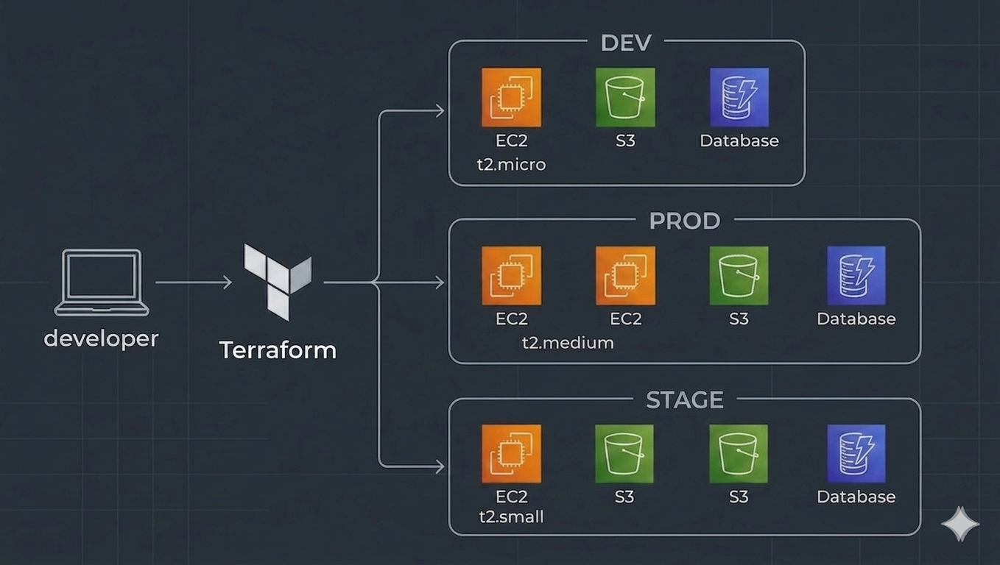

# Terraform Multi-Environment Infrastructure Project

This repository contains a Terraform project designed to provision and manage AWS infrastructure across multiple environments (Dev, Stage, and Prod) using a modular approach.

## Project Structure

The root directory contains the main configuration for the environments, which call an underlying AWS infrastructure module (`./Modules-AWS`). It also configures a remote backend for state management.

```text
.
├── main.tf              # Workspace config map + module calls
├── variables.tf         # Root variables (AMI, instance type, key path)
├── outputs.tf           # Surfaces all module outputs
├── providers.tf         # AWS provider (ap-south-1)
├── terraform.tf         # Required providers & version
├── Remote-Backend/      # Remote backend configuration for state management
│   ├── dynamo.tf        # DynamoDB table for state locking
│   └── s3.tf            # S3 bucket for storing terraform.tfstate
└── Modules-AWS/
    ├── ec2/             # Key pair, security group, EC2 instances
    ├── s3/              # S3 buckets with public access block
    └── dynamodb/        # DynamoDB tables (PAY_PER_REQUEST)
```

### Key Files
- `main.tf`: Defines the environments (`Dev-app`, `Stage-app`, `Prod-app`) by passing environment-specific variables to the underlying module.
- `provider.tf`: Configures the AWS provider and sets the default region to `ap-south-1`.
- `terraform.tf`: Configures the required providers and the S3/DynamoDB remote backend.
- `output.tf`: Outputs essential information such as EC2 instance IPs and S3 bucket IDs for each environment.

## Multi-environment Architecture



| Resource | dev | stage | prod |
|---|---|---|---|
| EC2 Instances | 1 | 1 | 2 |
| S3 Buckets | 1 | 1 | 1 |
| DynamoDB Tables | 1 | 1 | 1 |

---

## Prerequisites

- Terraform >= 1.0.0
- AWS CLI configured with appropriate credentials
- An existing S3 bucket and DynamoDB table for the remote backend

## Usage

1. **Initialize**
   This downloads the necessary provider plugins and configures the remote backend:
   ```bash
   terraform init
   ```

2. **Deploy dev environment**
   Create and switch to the `dev` workspace, then deploy:
   ```bash
   terraform workspace new dev
   terraform plan
   terraform apply
   ```

3. **Deploy prod environment**
   Create and switch to the `prod` workspace, then deploy:
   ```bash
   terraform workspace new prod
   terraform plan
   terraform apply
   ```

4. **Switch between workspaces**
   List workspaces, switch contexts, and view outputs:
   ```bash
   terraform workspace list
   terraform workspace select dev
   terraform output
   ```

5. **Destroy**
   To tear down the infrastructure:
   ```bash
   # Destroy current workspace's infra
   terraform destroy

   # To destroy both environments
   terraform workspace select dev && terraform destroy -auto-approve
   terraform workspace select prod && terraform destroy -auto-approve
   ```

## Outputs
After a successful apply, Terraform will display the public IPs of the created EC2 instances and the IDs of the environment-specific S3 buckets. You can always retrieve these values by running:
```bash
terraform output
```
